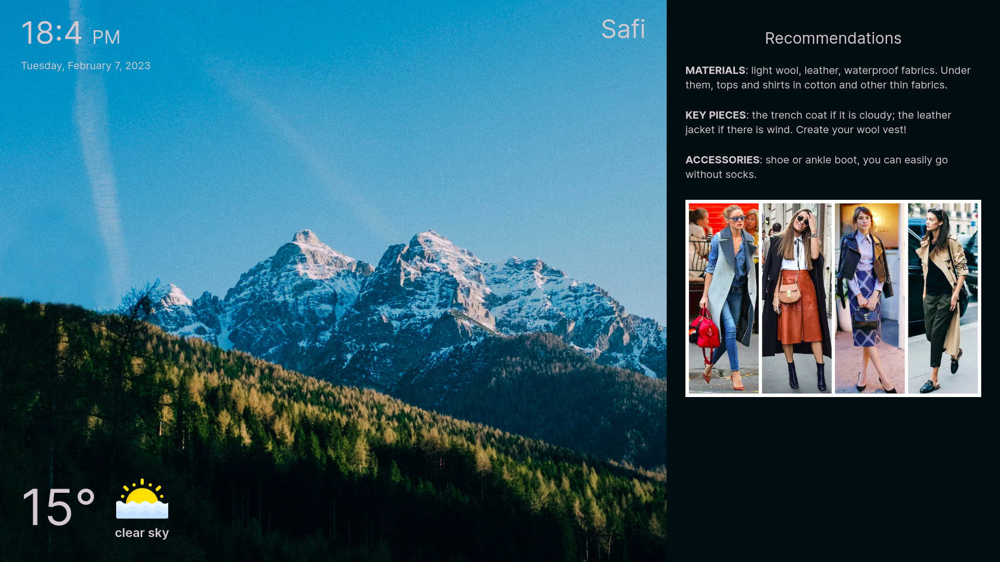

# what-to-wear

A little web app that recommends clothing based on the current weather in your city.

# Screenshot



## Getting Started

1. run the development server:

```bash
npm install
npm run dev
```

2. Open [http://localhost:3000](http://localhost:3000) with your browser.

3. trun on your location 

4. check out the outfit inspo!
